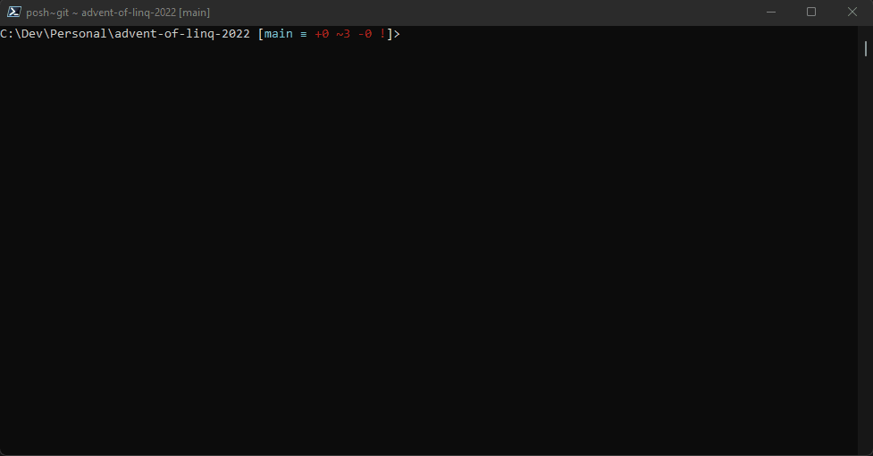

# ⭐️ Advent of ~~Code~~ LINQ 2022 ⭐️

The [adventofcode.com](https://adventofcode.com/) challenge for year 2022.

Let's do this in [LINQ](https://learn.microsoft.com/en-us/dotnet/csharp/programming-guide/concepts/linq/) this year.

> I know, I know - not everything can be solved by LINQ and not every solution is optimal when using LINQ. That being said, LINQ is fun (I promise)!

**Notice:**

All code written for this years' Advent of Code was synthesized by an organic intelligence (classification pending 😆) called MyBrain™. I do not use intelligent coding assistants or other types of tools to come up with these solutions.

## 🎄🎄 Requirements

* `net7.0` is expected. Download the SDK [here](https://dotnet.microsoft.com/en-us/download/dotnet/7.0).
* that's it - you didn't expect `node` right?

## 🎄🎄 Outline

Problems added as unit test classes in the project `.\src\AdventOfCode22Tests\AdventOfCode22Tests.csproj` (or you can open the `AdventOfLinq.sln` solution file to find the tests).

Problems will be identified by test classes corresponding on the days of the challenge (e.g. `Day1.cs` will represent the 1st of December challenge).

To run the tests, run the `dotnet test` command in the root of the repository.

To run a specific subset of tests, run the following filtered command:

```pwsh
dotnet test --filter SystemCheck
# or
dotnet test --filter Day0
# or combine them
dotnet test --filter "Day0&SystemCheck"
```

... or do your [worst](https://github.com/Microsoft/vstest-docs/blob/main/docs/filter.md).

## 🎄🎄 Other remarks

~~I'll try to commit the results of a particular challenge no less than 24 hours after the next challenge is revealed.~~
I'll commit sooner, everyone is doing it anyway.

For more, follow me ...uhm... here, I guess.

## 🎄🎄 Fun side project

You can also have fun with the tool that lives in this repository called `aoc`. The tool source code is located in the `tools` folder and is installed in this repository as a dotnet tool.

To use the tool, run the `dotnet tool restore` command once. After that, feel free to invoke the tool using the `dotnet aoc` command.

You can of course start from scratch and install the tool where ever you want, just type in the following:

```pwsh
dotnet pack
dotnet tool install --add-source .\tools\nupkg AocTool
```

(but, there's really no need)

See the next sections on what this tool can do.

> Note: If you do not wish to install the tool, commands `dotnet aoc` and `dotnet run --project .\tools --` are completely interchangeable so you can utilize the tool even when it's not installed - it's just a console application (`dotnet run --project .\tools -- --help` === `dotnet aoc --help`).

**Note to self (you're going to forget anyway):** this is how you update the tool locally after developing new feature:

* update version in AocTool.csproj
* run `dotnet pack`
* run `dotnet tool update --add-source .\tools\nupkg AocTool`

## 🎄🎄 Lazy?

Yes! Head over to `tool/AocTool.csproj` (or install it using the hints from previous section) to do the following awesome tasks:

* Download your personalized puzzle inputs automatically
* Create pre-populated test classes for the current day
* Log in to https://adventofcode.com/ ...sort of
* Be lazy

Ok, here's how it works...

> Make sure you have a CLI open and are located in this repository root folder (the one that has .git folder in it)

1. Make sure you're logged in to https://adventofcode.com
2. Grab the session token (F12-developer tools -> application -> cookies -> https://adventofcode.com -> session -> [copy the value])
3. Run `dotnet aoc session --set <token from step 2>` which will cache the token locally. Yay! You hacked the AOC (run). You only need to do this once per....idk...didn't bother to check.
4. Run `dotnet aoc load` to download the puzzle data for the current day (or use the `--day` flag - if you're late or something). Check out the new `data` directory being created in the root of the repo.
5. Run `dotnet aoc generate` to generate a test class for the current day(or use the `--day` ....yada yada...you know). Check out a brand new test class in your tests project.
6. That's the easy part... solve the puzzle!

> Btw, if you're stuck with the tool, just run `dotnet aoc --help` - I commented the sh...snow out of it ;)

## 🎄🎄 Lazy²? - `dotnet aoc makemyday` !

Assuming you are already logged in using the `dotnet aoc session --set <token>`, just type `dotnet aoc makemyday` and enjoy the tool automatically: 

* create a new test class for the current day, 
* download your personal data set required for the current day challenge,
* link your test data to the newly created test class (ready to run),
* create a benchmark suite already linked to the downloaded test data (ready to run)
* provide you with a website link for the current challenge,
* ~~and bring you a cup of freshly brewed coffee.~~ (alpha - donation required LOL)




## Benchmarks

``` ini

BenchmarkDotNet=v0.13.2, OS=Windows 11 (10.0.22000.1098/21H2)
Intel Core i7-10750H CPU 2.60GHz, 1 CPU, 12 logical and 6 physical cores
.NET SDK=7.0.100
  [Host]     : .NET 7.0.0 (7.0.22.51805), X64 RyuJIT AVX2
  DefaultJob : .NET 7.0.0 (7.0.22.51805), X64 RyuJIT AVX2


```


### Results for day 1

|          Method |     Mean |   Error |  StdDev |
|---------------- |---------:|--------:|--------:|
| Benchmark_Part1 | 390.5 μs | 6.00 μs | 5.61 μs |
| Benchmark_Part2 | 408.1 μs | 7.92 μs | 9.12 μs |

### Results for day 2

|          Method |     Mean |    Error |   StdDev |   Median |
|---------------- |---------:|---------:|---------:|---------:|
| Benchmark_Part1 | 559.6 μs | 10.83 μs |  9.60 μs | 561.2 μs |
| Benchmark_Part2 | 632.2 μs | 23.47 μs | 69.21 μs | 592.1 μs |

### Results for day 3

|          Method |     Mean |    Error |   StdDev |
|---------------- |---------:|---------:|---------:|
| Benchmark_Part1 | 632.9 μs | 12.26 μs | 17.96 μs |
| Benchmark_Part2 | 477.1 μs |  9.29 μs |  9.54 μs |

### Results for day 4

|          Method |     Mean |     Error |    StdDev |
|---------------- |---------:|----------:|----------:|
| Benchmark_Part1 | 2.620 ms | 0.0500 ms | 0.0836 ms |
| Benchmark_Part2 | 2.511 ms | 0.0501 ms | 0.0794 ms |

### Results for day 5

|          Method |     Mean |   Error |  StdDev |
|---------------- |---------:|--------:|--------:|
| Benchmark_Part1 | 342.9 μs | 6.02 μs | 6.44 μs |
| Benchmark_Part2 | 457.2 μs | 7.75 μs | 8.62 μs |

### Results for day 6

|          Method |       Mean |    Error |   StdDev |
|---------------- |-----------:|---------:|---------:|
| Benchmark_Part1 |   443.3 μs |  8.77 μs | 12.86 μs |
| Benchmark_Part2 | 1,522.2 μs | 29.72 μs | 43.56 μs |

### Results for day 7

|          Method |     Mean |     Error |    StdDev |
|---------------- |---------:|----------:|----------:|
| Benchmark_Part1 | 2.134 ms | 0.0422 ms | 0.0578 ms |
| Benchmark_Part2 | 2.773 ms | 0.0552 ms | 0.1404 ms |

### Results for day 8

|          Method |     Mean |   Error |   StdDev |   Median |
|---------------- |---------:|--------:|---------:|---------:|
| Benchmark_Part1 | 214.2 ms | 6.41 ms | 18.91 ms | 212.6 ms |
| Benchmark_Part2 | 279.9 ms | 8.20 ms | 24.19 ms | 273.1 ms |

### Results for day 9

|          Method |     Mean |    Error |   StdDev |   Median |
|---------------- |---------:|---------:|---------:|---------:|
| Benchmark_Part1 | 11.31 ms | 0.218 ms | 0.441 ms | 11.20 ms |
| Benchmark_Part2 | 56.51 ms | 1.129 ms | 3.165 ms | 55.42 ms |

### Results for day 10

|          Method |     Mean |    Error |   StdDev |
|---------------- |---------:|---------:|---------:|
| Benchmark_Part1 | 121.3 μs |  1.94 μs |  1.82 μs |
| Benchmark_Part2 | 683.8 μs | 13.39 μs | 15.94 μs |

### Results for day 11

|          Method |         Mean |       Error |      StdDev |
|---------------- |-------------:|------------:|------------:|
| Benchmark_Part1 |     124.5 μs |     2.45 μs |     3.10 μs |
| Benchmark_Part2 | 175,877.8 μs | 3,472.50 μs | 7,324.69 μs |

### Results for day 12

|          Method |      Mean |     Error |    StdDev |
|---------------- |----------:|----------:|----------:|
| Benchmark_Part1 |  1.063 ms | 0.0204 ms | 0.0227 ms |
| Benchmark_Part2 | 94.325 ms | 1.1673 ms | 0.9747 ms |

### Results for day 13

|          Method |     Mean |     Error |    StdDev |   Median |
|---------------- |---------:|----------:|----------:|---------:|
| Benchmark_Part1 | 2.694 ms | 0.0525 ms | 0.0515 ms | 2.697 ms |
| Benchmark_Part2 | 8.665 ms | 0.1731 ms | 0.3800 ms | 8.510 ms |

### Results for day 14

|          Method |       Mean |     Error |    StdDev |
|---------------- |-----------:|----------:|----------:|
| Benchmark_Part1 |   5.141 ms | 0.1015 ms | 0.1456 ms |
| Benchmark_Part2 | 176.613 ms | 3.4944 ms | 8.0290 ms |


<!-- end benchmarks -->


🎄🎄🎄🎄🎄🎄🎄🎄🎄🎄🎄🎄🎄🎄🎄🎄🎄🎄